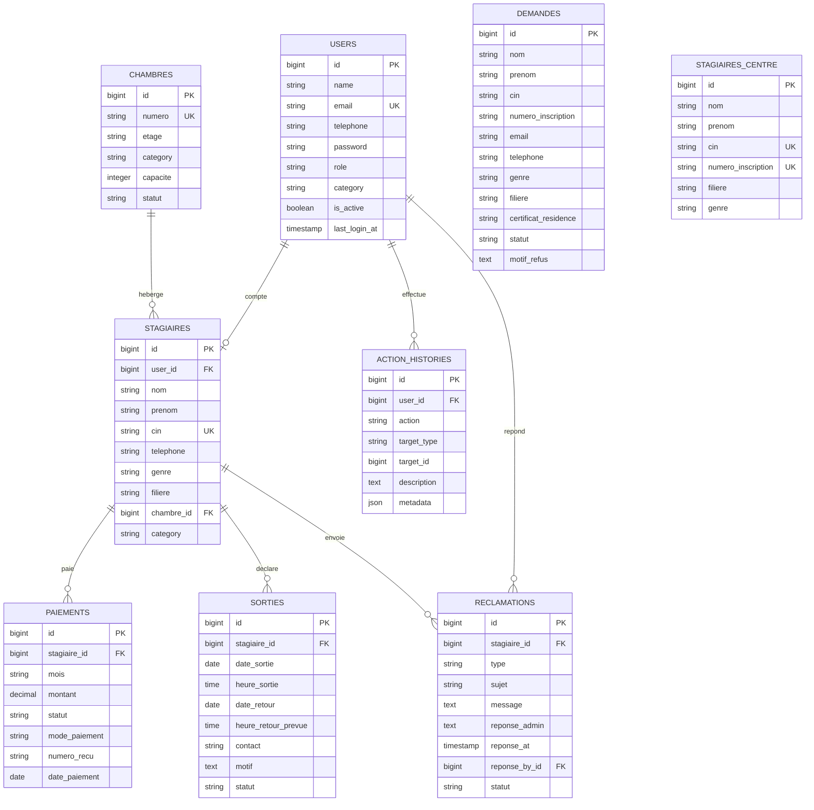

# Schema base de donnees - EasyInternat

Ce diagramme resume les tables principales et les relations du projet.

## Notes metier

- `users.role` definit l'espace: admin, responsable ou stagiaire.
- `users.category` et `stagiaires.category` separent filles et garcons.
- `paiements` stocke les paiements reels deja effectues.
- Les statuts `A payer` et `En retard` sont calcules par `PaymentStatusService`.
- `sorties.statut_effectif` est calcule par le model `Sortie` selon la date et l'heure de retour prevue.
- `action_histories` garde une trace des actions sensibles.
